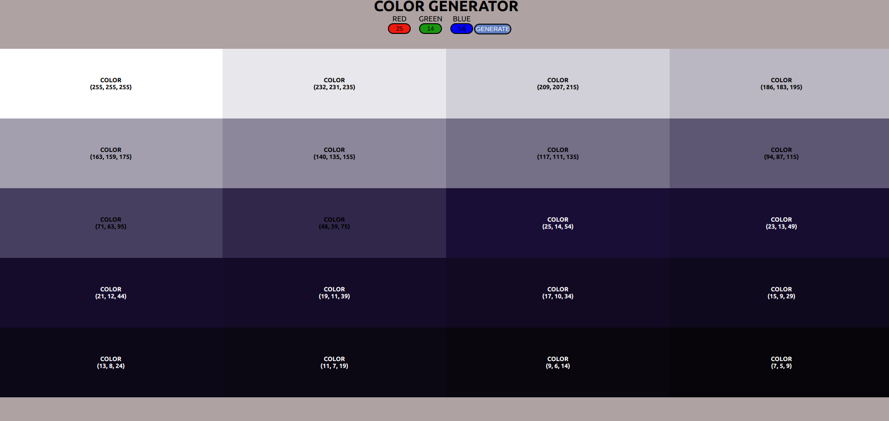

# COLOR PROJECT

## FULLSTACK REACT PRACTICE PROJECT NO: 8

1. I created this project to practice my skills using Javascript, React, NodeJS, ExpressJS, MongoDB, HTML, CSS.

2. I practiced useState and useEffect hooks. I used form.

3. When you enter rgb values and submit it, app will bring variety of that color and itself to the page with their rgb values.
